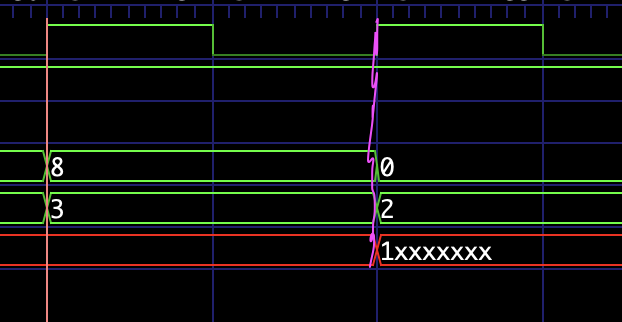

### UART Module
i want to experiment with FPGAs so i have decided to play with tangnano series

#### Disclaimer
I'm not going into depth with all the stuff so if you didn't understand it's probably
not explained that much cuz i have assumed that you are not absolutely beginner, BTW
sometimes I'll put samples and if you see problem in them it's probably true, because
sometimes i intend to put error then fix it down there, so just keep going you'll probably
reach when it was fixed, and I do that because I don't want to jump, i want to build to it


#### UART theory
uart is protocol that allows for data transmission there's multiple configuration i intend to implement
the simplest one 1 start bit 8 data bits and 1 stop bit no parity no multiple stop bits and so on


##### Implementation
before we start writing the code, since there's no clock line how would we sync between 
transmitter and receiver well they have to agree on baud rate (how many bits per second)
I decide to choose 115200 bits per second, but my FPGA is 27Mhz thus if i write/read every clock
cycle i'll be working with 27000000 bits per second which is not correct so maybe clock divider 
circuit? well let's think about it, so how would we divide 27Mhz to get to 115200 bps well let's
see 27M/115200 = 234.375 oops there's fraction how would I deal with it there are some tricks to 
deal with it but I'm going to just ignore the fraction part and divide by 234, but what impact 
does that have (removing the fraction part) well if we divide 27M/234=115384.6... the problem is 
that i'll be reading/writing more than expected but is that fine? because we are not that far way
well that depends here's a simple picture that may help


red line is the target 115200 exact blue lines are the result of 27M/234=115384.6... at first it 
seems there is no problem


now you can start that there is shift but even with the sift the sampled data will be correct


now it's clear problem, but what is the effect well I'm not going to deal with this now, and I 
don't believe that I'll see a problem because there's that idle state because when in idle it's 
like reset i believe that it'll be problem when there's consecutive sends but since i intend to 
not operate that fast, if i see problems i'll investigate it

###### Ideas of Implementation
state machine of course i'm going to have some kind of counter remember that i'm not going to 
send every clock cycle, and what are the states at first glance it's seems that 4 is enough
start state, sending/reading state, stop state and idle state, well i tried it's not that simple 
specially because i don't want to read while data is changing it would be great if i read in the 
middle of the da  ta bit not at the edge because the data line is changing and I might get 
corrupted data what i was intending is that start at *idle state* then when rx line goes low we 
move to *start state* and wait for 234 and then move to *reading state* after reading is done go to stop state then idle, let's revise this because of i don't want to reading at the edge
start at idle move to to start but now i'm not going to wait the entire 234 cycles i'll half of 
that but now i can't read since data is not available we move to another state we call it 
**WAITING STATE** and then wait 234 that would put us right in the middle of data bit so we read
thus we effectively avoided that edge problem so we read one bit move back to waiting state and 
wait there 234 and go to reading and so one 8 times then go to stop here's diagram that might 
help

###### Before


###### After


I usually miss that wait stuff by one cycle so i want to handle first should I have counter that
is counting from 0 to 233 or 234 and will I start from 1 if so to what should I stop to achieve 
what i need which is to 234 periods to pass let's test it

look at the file tests/counter_value_in_while_waiting_in_start.v

```v
    counter <= counter + 1;
    if (counter == WAIT_NUMBER) begin // WAIT_NUMBER not WAIT_NUMBER-1
        counter <= 0;
        state <= 2; // for debugging done waiting
    end
```

to understand i have decided that I'll start with 1 because it does make sense because we we 
detect the rx_line to be low it's already one clock cycle in, i did 8 for debugging and as will 
see below it's going to wait 8 periods before moving to the next state


let's start implementing at least the first part

since we have 5 states we need 3 bit state register

```v
localparam RX_STATE_IDLE = 0;
localparam RX_STATE_START = 1;
localparam RX_STATE_WAIT = 2;
localparam RX_STATE_READ = 3;
localparam RX_STATE_STOP = 4;

reg [2:0] state;
```

let's make WAIT_CYCLES parameter so I can do some easy debugging later
```v
#(parameter WAIT_CYCLES=234)
```

since i need to wait half of WAIT_CYCLES let's make it as localparam

```v
localparam HALF_WAIT_CYCLES = WAIT_CYCLES/2;
```

we need a counter that needs to count up to 234 so we need register of 8 bits

```v
reg [7:0] counter;
```

we need some reg to hold what we will read from rx_line so i said that'l use 8 bit data 
configuration we need 8 bit register

```v
reg [7:0] data;
```

let's combine these

```v
module uart
#(parameter WAIT_CYCLES=234)
(
    input clk, uart_rx, btn,
    output uart_tx,
    output reg[5:0] led
);

localparam RX_STATE_IDLE = 0;
localparam RX_STATE_START = 1;
localparam RX_STATE_WAIT = 2;
localparam RX_STATE_READ = 3;
localparam RX_STATE_STOP = 4;

localparam HALF_WAIT_CYCLES = WAIT_CYCLES/2;

reg [2:0] state;
reg [7:0] counter;
reg [7:0] data;

endmodule
```

let's move on to the first part of our state machine we start with idle and we are going to move
to next state

```v
always @ (posedge clk) begin
    case(state)
        RX_STATE_IDLE: begin
            if (uart_rx == 1'b0) begin
                counter <= 1;
                state <= RX_STATE_START;
            end
        end
    endcase
end
```

the firs part is done let's add what will happen in start state

```v
always @ (posedge clk) begin
    case(state)
        RX_STATE_IDLE: begin
            if (uart_rx == 1'b0) begin
                counter <= 1;
                state <= RX_STATE_START;
            end
        end
        RX_STATE_START: begin
            counter <= counter + 1;
            if (counter == HALF_WAIT_CYCLES) begin
                counter <= 0;
                state <= RX_STATE_WAIT;
            end
        end
    endcase
end
```

now we need to setup waiting state

```v
always @ (posedge clk) begin
    case(state)
        RX_STATE_IDLE: begin
            if (uart_rx == 1'b0) begin
                counter <= 1;
                state <= RX_STATE_START;
            end
        end
        RX_STATE_START: begin
            counter <= counter + 1;
            if (counter == HALF_WAIT_CYCLES) begin
                counter <= 0;
                state <= RX_STATE_WAIT;
            end
        end
        RX_STATE_WAIT: begin
            counter <= counter + 1;
            if (counter == WAIT_CYCLES) begin
                state = RX_STATE_READ;
            end
        end
        RX_STATE_READ: begin
            // read data here 
        end
        default:
            state <= RX_STATE_IDLE;
    endcase
end
```

so in theory when the line uart_rx goes low we will move to start state wait for total of 234/2 
(from idle to after start state is done) and then we will move to wait state and wait for 234
let's see if this is what is happening, as you can see it does not make sense to work with 234
because it's too big i'm going to pass just 8 for debugging and 8 is small and when divided by
2 in (HALF_WAIT_CYCLES) there's no fraction

**here's the test bench**

```v
`timescale 1ns / 1ps

`include "uart.v"

module uart_tb;

reg clk;
reg btn;
reg uart_rx;

wire uart_tx;
wire [5:0] led;

uart #(.WAIT_CYCLES(8)) uut0(
    .clk(clk), .btn(btn),
    .uart_rx(uart_rx),
    .uart_tx(uart_tx),
    .led(led)
);

always #1 clk = ~clk;

initial begin
    clk = 1;
    $dumpfile("uart_tb.vcd");
    $dumpvars;

    uart_rx = 1; // idle
    #5;
    /* so internally we move from default case to
    idle state just setting up the state register */
    uart_rx = 0; // move to start state

    #200 $finish;

end

endmodule
```


as you can see we spend 9 periods in WAIT STATE instead of 8 so either we change counter
to start from 1 and count up to WAIT_CYCLES-1, I'm going to compare WAIT_CYCLES-1 just because
it's more intuitive and in WAIT state i don't want to think that's going on in it have something
to do with what happens in START state

```v
    RX_STATE_WAIT: begin
        counter <= counter + 1;
        if (counter == (WAIT_CYCLES - 1)) begin
            state = RX_STATE_READ;
        end
    end
```


now we need to read/sample data so something that may look like this

```v
RX_STATE_READ: begin
    data <= {uart_rx, data[7:1]};
end
```

you may have question of why

```v
data <= {uart_rx, data[7:1]};
```

and not

```v
data <= {data[6:0], uart_rx};
```

well that is because UART transmit data LSB first, and another question what because this code
will not wait WAIT_CYCLES and next clock will sample again, and if that is the case it'will 
sample the same bit, which is not what we want we need to wait and luckily for us we already
have RX_STATE_WAIT we could just jump to it

```v
RX_STATE_READ: begin
    data <= {uart_rx, data[7:1]};
    counter <= 0;
    state <= RX_STATE_WAIT;
end
```

okay that's seems fine but there's another problem, when are we going to stop because if we
just keep it like this it will like (infinite loop) WAIT to READ to WAIT to READ ....
we need somehow to track of how many bits that we have read so if that number is 8 we move
to STOP state so we need a register that will count up to 7 (0-7) is 8 bits

```v
reg [2:0] how_many_bits_are_ready;
```

```v
RX_STATE_READ: begin
    how_many_bits_are_ready <= how_many_bits_are_ready + 1;
    data <= {uart_rx, data[7:1]};
    counter <= 0;
    state <= RX_STATE_WAIT;
end
```

now we have kept track of how many bits we have read we could just add if statement there to move
to stop state something like this


```v
localparam DATA_WIDTH = 8;

RX_STATE_READ: begin
    how_many_bits_are_ready <= how_many_bits_are_ready + 1;
    data <= {uart_rx, data[7:1]};
    counter <= 0;
    if (how_many_bits_are_ready == DATA_WIDTH-1) begin
        state <= RX_STATE_STOP;
    end else begin
        state <= RX_STATE_WAIT;
    end
end
```

let's do some debugging and check/fix maybe


```v
`timescale 1ns / 1ps

`include "uart.v"

module uart_tb;

reg clk;
reg btn;
reg uart_rx;

wire uart_tx;
wire [5:0] led;

uart #(.WAIT_CYCLES(8)) uut0(
    .clk(clk), .btn(btn),
    .uart_rx(uart_rx),
    .uart_tx(uart_tx),
    .led(led)
);

always #1 clk = ~clk;

initial begin
    clk = 1;
    $dumpfile("uart_tb.vcd");
    $dumpvars;

    uart_rx = 1; // idle
    #6; // so internally we move from default case to idle state just setting up the state register
    uart_rx = 0; // move to start state
    #16;
    uart_rx = 1;
    #16;
    uart_rx = 0;
    #16;
    uart_rx = 1;
    #16;
    uart_rx = 1;
    #16;
    uart_rx = 0;
    #16;
    uart_rx = 0;
    #16;
    uart_rx = 1;
    #16;
    uart_rx = 0;
    #16;
    uart_rx = 1; // go to stop

    #100 $finish;

end


endmodule
```




as you can see that there's problem we sample one period late, we could sample in RX_STATE_WAIT
but that would give a problem for the first bit and we are going to sample early because
RX_STATE_WAIT can come from READ state or start state, we could add another WAIT state special 
for START or something specifically for READ state, but if you noticed that even if we are
one period late we still read the correct data but that shift will add up over time and maybe
will gives wrong data, but the key point here **First Bit Even Late CORRECT** what I'm thinking
of let that be, and I'll accommodate for it in later bits by starting counter at 1 okay are not
we short by 1 again well it may seem so, we spend WAIT_CYCLES-1 periods in WAIT because we start 
the counter at 1 but we spend 1 cycle in read so that's why in total we spend accommodate for it
let's see BTW

**NEW**
```v
RX_STATE_READ: begin
    how_many_bits_are_ready <= how_many_bits_are_ready + 1;
    data <= {uart_rx, data[7:1]};
    counter <= 1; // CHANGE
    if (how_many_bits_are_ready == DATA_WIDTH-1) begin
        state <= RX_STATE_STOP;
    end else begin
        state <= RX_STATE_WAIT;
    end
end
```


when this condition is true
```v
if (how_many_bits_are_ready == DATA_WIDTH-1) begin
```

we should move to stop state and wait WAIT_CYCLES and play with the data


now data is ready i could do something with it in STOP state, but I decided to do separate always
block for clarity, but the always block will be based on what let's add another register/flag **byte_is_ready**

```v
always @ (posedge clk) begin
    if (byte_is_ready) begin
        led <= ~data[5:0];
    end
end
```

let's test it


it seems that is everything is working

i was intending to explain the toolchain setup also but It got complicated to add here maybe I'll do
it separately

#### Result

here's how to connect to it

```sh
sudo cu -l /dev/cu.usbserial-212301 -s 115200
```


i wrote `I` which is `0b1001001`

and here's the FPGA

